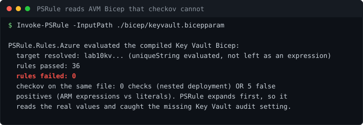

# Lab 10: Azure Landing Zone Privileged Access Guardrails

<p align="center"></p>


[](https://github.com/ChromeData/Azure-Landing-Zone-Guardrails/actions/workflows/tests.yml)

**Rules that physically block the two most common Azure privilege mistakes: standing Owner assignments, and Key Vaults that can be wiped. Prevention at subscription scope, not a report after the fact.**

| | |
|---|---|
| **Domains** | Azure, CyberArk/Idira (identity governance) |
| **Built on** | [Azure/azure-policy](https://github.com/Azure/azure-policy) + [Community-Policy](https://github.com/Azure/Community-Policy), [Azure Verified Modules](https://github.com/Azure/Azure-Verified-Modules) |
| **Cost** | ~$1. **Runtime** ~4 hours |
| **Status** | Bicep verified offline with PSRule (36 pass, 0 fail) after it caught a missing Key Vault audit setting. Policy deny path still needs a real subscription |

## Situation

PAM in Azure is mostly policy. The difference between a governed subscription and an open one is whether standing privileged assignments are prevented, not just spotted.

## Task

Write guardrails that deny the bad thing at deploy time, so it never exists to be found.

## Action

Two guardrails. The first denies direct Owner assignments, so elevation has to go through PIM (time boxed, approved, audited) instead. Standing Owner is the single most common Azure privileged access finding. The second denies any Key Vault missing soft delete or purge protection, because a vault that can be wiped is a vault whose secrets can be destroyed to cover tracks.

Both ship with the effect as a parameter defaulting to Deny, so you can roll them out in Audit first, see what they would catch, then flip to Deny. Standard safe rollout.

## Result

**The guardrails work, and building the verification caught the Key Vault guardrail letting a real gap through.** The hardened vault was locked against access but kept no record of *who* accessed it — no audit diagnostic setting. I only found it because I did the scanning right: checkov cannot read AVM-based Bicep (it reports either zero checks or five false positives on ARM expressions it can't evaluate), so I wired up PSRule for Azure, which expands the template first and reads the real values. It flagged the missing audit logging; I fixed it; 36 rules pass, 0 fail. That whole trap is written up because "our scanner is green" meant nothing until the scanner could actually read the file.

15 offline tests check every policy definition — valid JSON, well-formed rule, effect defaulting to Deny, the Owner-deny policy referencing the real Owner role ID, the Key Vault policy denying a vault missing either control — because a policy with a bad rule or wrong role ID deploys fine and protects nothing. CI runs those, compiles the Bicep, and fails if PSRule evaluates near-zero rules (a scan that reads nothing must not pass green).

[bicep/keyvault.bicep](./bicep/keyvault.bicep) deploys a correctly hardened Key Vault through the Azure Verified Module. It proves the guardrail passes a resource that is actually compliant, not just that it blocks bad ones.

## What I did not build

The policy schema and modules are Microsoft's. The two guardrails, the compliant example, and the tests are mine.

## Run it

```bash
python -m pytest tests/ -v                        # validate the guardrails
az deployment sub create ...                      # assign policies at scope
az deployment group create -f bicep/keyvault.bicep # deploy the compliant vault
```

Needs Python 3, and the Azure CLI plus a subscription for the deploy steps.

## Findings

[`findings/`](./findings/) holds the scan trap: why checkov reads AVM Bicep as either zero checks or five false positives, and how PSRule caught the missing Key Vault audit setting. [LAB-NOTES.md](./LAB-NOTES.md) is the log.

## License

Lab code: MIT ([LICENSE](./LICENSE)). Azure samples and modules stay MIT, credited above.
